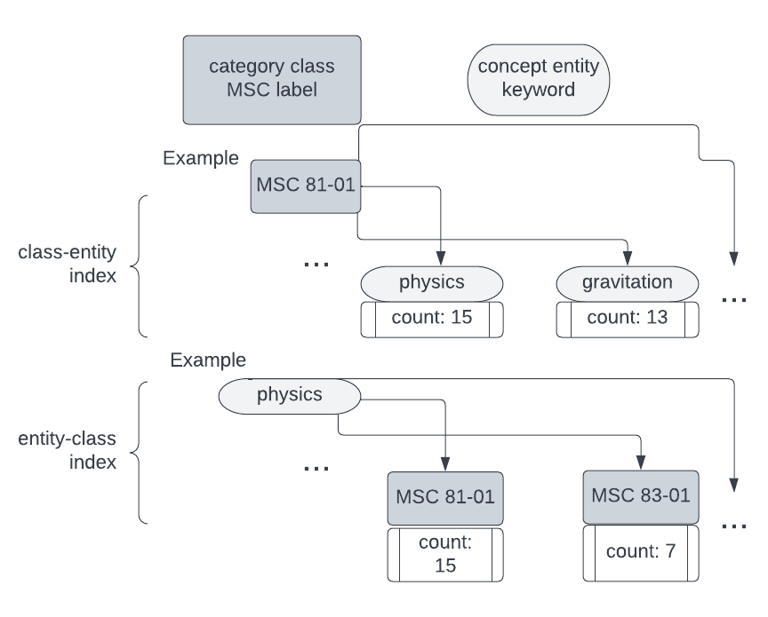
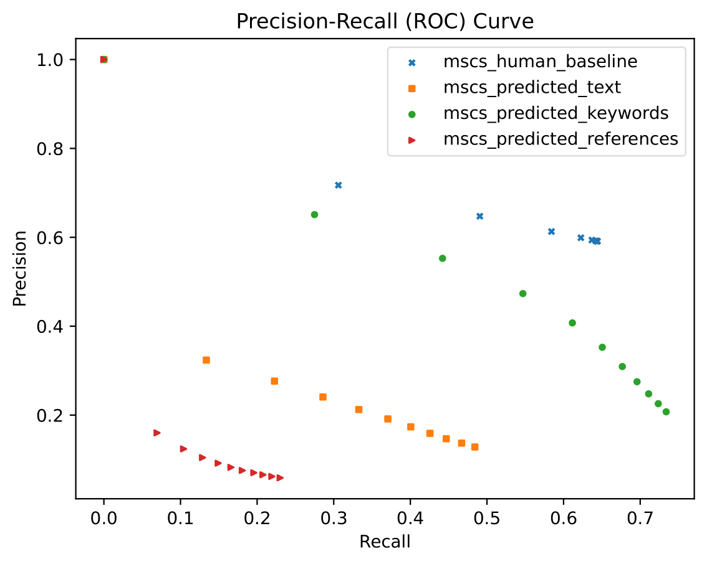
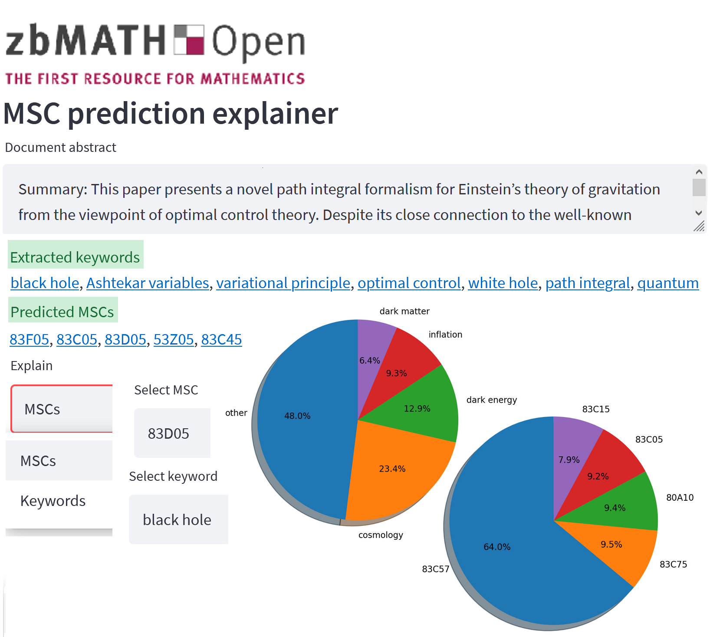

# Explainable Fine-Grained Document Classification for Mathematical and Medical Texts

This manual provides descriptions to reproduce the results of the associated paper.

An interactive notebook to easily run the code can be found at https://purl.org/fine-class.

Document subject classification enables structuring (digital) libraries and allows readers to search for articles within a specific field.
Currently, the classification is typically provided by human domain experts.
Semi-supervised Machine or Deep Learning algorithms can support them by exploiting labeled data to predict subject classes of unclassified new documents.
However, these algorithms only work or yield useful results if the ratio of training examples per class is high.
In the case of mathematical documents, the commonly used Mathematical Subject Classification (MSC) leads to multiple challenges: The classification is 1) multi-label, 2) hierarchical, 3) fine-grained, and 4) sparsely populated with examples for the more than 5,000 classes.
In this paper, we address these challenges by using class-entity relations to enable multi-label hierarchical fine-grained category predictions for the first time while providing high explainability.
We examine relationships between fine-grained subject classes and keyword entities, mining a dataset from the zbMATH library https://zbmath.org.

## Requirements

Before executing the algorithms, it is necessary to install the python modules into your local virtual environment (venv) using the provided requirements.txt

## Fine-Grained MSC Prediction

Data and algorithms can be found in the folders 'data' and 'src' respectively.

The script
```
src/evaluate_classification.py
```
contains all required steps in the data processing pipeline.

### 1) Load train table

First download the full

[zbMATH Open Mathematics Subject Classification Dataset](https://zenodo.org/record/6448360)

After specifiying the
```
train_path = './data/out.csv'
```
of the local dataset csv file, the
```
train_table = pd.read_csv(fullpath,delimiter=',')
```
can be read in using the python pandas module.

### 2) Get mapping indexes

Next, the indexes are loaded via (if missing, automatically created from the input table)
```
load_indexes()
```
The figure below shows an example index structure


### 3) Index statistics

The index statistics are generated using
```
print_index_statistics(sorted_cls_ent_idx,sorted_ent_cls_idx)
```

### 4) Load test table

The MR-MSCs baseline
```
msc-zbmath-mr.csv
```
can be downloaded from
```
https://zenodo.org/record/5884600
```

After specifiying the
```
test_path = './data/out-mr.csv'
```
of the local dataset csv file, the
```
test_table = pd.read_csv(fullpath,delimiter=',')
```
can be read in using the python pandas module.

### 5) Predict MSCs

To predict the MSCs from text, keywords, and references use
```
predict_text_mscs(test_table)
```
and
```
predict_keyword_mscs(test_table)
```
and
```
predict_reference_mscs(test_table)
```
You can set the
```
nr_mscs_cutoff = X
```
The prediction tables are finally saved to the specified
```
'data/mscs_prediction_table_{text,keywords,references}_cutoffX.csv'
```

### 6) Evaluate MSC predictions

The evaluation in comparison to the MR-MSCs and keywords baseline is made by
```
compare_mr_keyword_refs_dcgs(table)
```

### 7) Get precision-recall curves

Finally, the precision recall curves for the predictions in comparison to the baseline (mr-mscs) are generated via
```
get_precision_recall_curves()
```
and saved to
```
./data/prec-rec-curve.pdf
```
The figure below shows a plot of the generated precision-recall curves


### 8) Run MSC prediction explainer demo
To try out a demo of the MSC prediction from (abstract) text or keyword entities, run the streamlit User Interface with
```
run_viewer.py
```
The figure below shows a screenshot of the explainer demo UI


## Wikisource Entity Linking (Wikification)

Data and algorithms can be found in the folder 'src/entity linking'.

### 1) View manual evaluation

The manually evaluated entity linking is contained in
```
zbmath keywords evaluation_all.csv
```
or excluding not available (N/A) linkings (no Wikidata QID) in
```
zbmath keywords evaluation_notna.csv
```

### 2) Score manual evaluation

The manual assessment is evaluated with the binary scoring (TP, FP, FN, TN) made via
```
get_evaluation_entity_linking.py
```

### 3) Wikidata seeding table

The entity linking table can be seeded to Wikidata using the
[Quickstatements Toolforge](https://quickstatements.toolforge.org).
See our example batch for
```
qid-msc_wikidata-seeding.csv
```
executed at
```
https://quickstatements.toolforge.org/#/batch/85955
```
